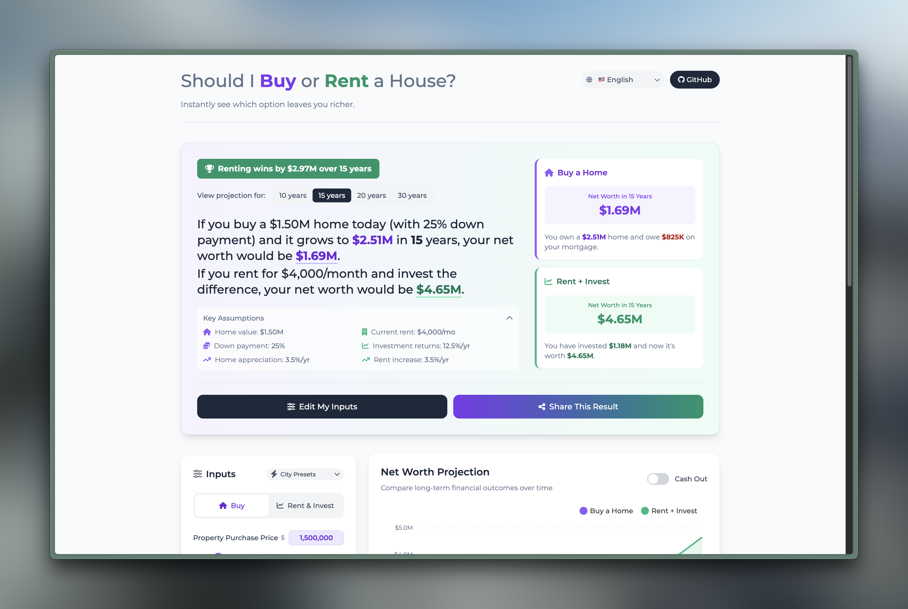

<div align="center">


<br><br>

<p>
   
   
   
   
   
   
</p>

<div align="center">

**[► 🏠 Try it Now ◄](https://rent-or-buy.homes)**

</div>

<p>
   <a href="#english"></a>
   &nbsp;&nbsp;
   <a href="#中文"></a>
   &nbsp;&nbsp;
</p>

</div>

<div align="center">
  <sub>Thank you for checking out rent-or-buy.homes! If you find it useful or interesting, consider giving this repository a <strong>star</strong> ⭐. It helps others discover the project too.</sub>
</div>

---

<div id="english">

<h2 align="center">🏠 <a href="https://rent-or-buy.homes">rent-or-buy.homes</a></h2>
<p align="center"><sub><i>Instantly see which option leaves you richer.</i></sub></p>



<br>

Buying a house is one of the biggest financial decisions in our lifetime. Yet surprisingly, many focus on _which_ house to buy while skipping the more fundamental question:

<p align="center"><strong><i>Should I buy a house at all?</i></strong></p>

This web app helps you answer that question by showing you exactly how choosing to buy versus rent could impact your net worth over 10 or 20 years. We're talking about differences that can reach hundreds of thousands or even millions of dollars.

### 🎯 What It Does

- 🏠 **Beyond monthly payments**: Compare the true long-term wealth impact, not just monthly costs
- 📊 **Data-driven decisions**: See real projections with interactive charts and breakdowns
- 💰 **Opportunity cost**: Understand what you gain or lose by tying up money in a home vs. investing it
- 🎯 **Personalized results**: Input your specific situation, location, and financial assumptions

The app considers everything from mortgage payments and property taxes to investment returns and capital gains—giving you a clear picture of which path builds more wealth for your unique situation.

**No sign-up, no ads, no data stored on our servers—just instant, transparent math.**

### 🖥️ How to Use

**Step 1: Pick a preset or start fresh**
Choose how far into the future you want to project (10, 15, 20, 30 years). And choose a city preset (e.g. Seattle, WA) to load the default numbers based on the city's housing market.

**Step 2: Tweak Your "Buy" Scenario**

- 🏠 **Home details**: Property purchase price, down payment percentage, mortgage interest rate and term
- 💰 **Transaction costs**: Closing costs when buying, potential selling costs when you eventually sell
- 🏠 **Ongoing costs**: Property taxes, insurance, maintenance, and HOA fees
- 📈 **Growth assumptions**: Expected home appreciation rate
- 💸 **Tax considerations**: Your marginal tax rate, mortgage interest deduction, and capital gains rates

**Step 3: Tweak Your "Rent" Scenario**

- 🏠 **Rental details**: Current monthly rent and expected annual rent increases
- 📊 **Investment plan**: Choose from preset investment options (like S&P 500, NASDAQ 100) or set a custom expected return

**Step 4: Review Your Results**

- Hero banner tells you which scenario leaves you wealthier and by how much.
- Net-Worth chart visualises the wealth difference over time.
- Cash-Outflow chart reveals where your money actually goes.

### ✨ The Calculation Method

**The Core Logic**

Same money in, see who ends up richer.

1. Same cash out the door
   Each year we total what you spend under each path.
2. Cheap-wins bonus goes to investing
   Whenever one path costs less, the savings aren’t lost—they’re poured into an index-fund bucket for that path.
3. End-of-game tally
   After your chosen horizon we:
   - sell the house (minus agent fees),
   - cash out the fund (minus capital-gains tax),
   - pay off any mortgage balance.

The bigger pile wins.

Quick example:

- Year 0: buyer writes a big cheque (down-payment + closing); renter just pays the first year’s rent. That gap turns into the renter’s seed investment.
- Later years: buyer pays mortgage + taxes; renter pays rising rent. If one month the rent is $800 cheaper than owning, the renter invests that $800; if owning is cheaper, the buyer invests the difference instead.

**Put simply: spend the same, invest the spare—then see who’s richer.**

### 📝 Behind the scenes

Our calculations include these features for accuracy:

- ✅ **Mortgage amortization**: Full payment schedules with principal/interest breakdown
- ✅ **Tax optimization**: Mortgage interest deductions based on your tax bracket
- ✅ **Compound growth**: Both property appreciation and investment returns compound annually
- ✅ **Real-world costs**: Transaction fees, maintenance, insurance, and other ownership costs
- ✅ **Capital gains handling**: Different tax rates for property vs. investment gains, including tax-free thresholds

**Why This Approach Works**

This method captures the true opportunity cost of homeownership by accounting for:

- The time value of money (compound growth)
- Tax implications of both scenarios
- All associated costs, not just monthly payments
- Growth assumptions for both property and investments

All calculations are pure TypeScript functions (see [src/lib/finance/](src/lib/finance/)). No external APIs touch your data; everything runs in the browser.

> [!NOTE]
> Highlights information that users should take into account, even when skimming.

> [!NOTE]
> If you are interested in the calculation logic, there is also an Excel version of this calculator under [reference/validate.xlsx](reference/validate.xlsx). You can use it to calculate the results manually as well.

### 📝 License

This project is licensed under the MIT License - see the [LICENSE](LICENSE) file for details.

### 🚀 Development & Contributing

- [Open an issue](https://github.com/zebangeth/rent-or-buy.homes/issues/new) if you have suggestions or find a bug
- Fork the repository and submit a PR for new features or bug fixes

**Prerequisites**

- Node.js 18+
- npm or yarn

**Installation**

```bash
# Clone the repository
git clone https://github.com/zebangeth/rent-or-buy.homes.git
cd rent-or-buy.homes

# Install dependencies and start development server
npm install
npm run dev
```

The app will be available at `http://localhost:5173`

#### 🛠️ Tech Stack

**Core Framework**: React 19, TypeScript, Vite
**UI & Styling**: Tailwind CSS, ApexCharts
**State Management & Routing**: React Context, React Router v7, LZ-String
**Internationalization**: i18next, react-i18next

#### 🏗️ Architecture

```
┌──────────────┐     state updates      ┌──────────────┐
│  InputPanel  │ ────────────────────►  │   AppContext │
│              │                        │  (useReducer)│
└──────────────┘                        └───────┬──────┘
                                                │
                                                ▼
┌──────────────┐                        ┌──────────────┐
│   URLSync    │◄─── history.replace ───│ ResultPanel  │
│   Hook       │                        │   + Charts   │
└──────────────┘                        └──────────────┘
```

**Key Components**

- **AppContext**: Centralized state management for all calculations
- **Financial Engine**: Pure calculation functions in `src/lib/finance/`
- **Input Components**: Reusable sliders, buttons, and number inputs
- **Result Visualization**: Charts and summary cards
- **URL Synchronization**: Automatic state persistence in URLs

#### 🔮 Work in Progress

- [ ] **Advanced Charts**: More detailed financial projections
- [ ] **Shareable Links**: Share the results with others
- [ ] **City Presets**: Refine the city presets numbers and add more cities
- [ ] **PDF Export**: Generate detailed reports

<br />
<div align="center">
  <sub>Thank you for reading! If you find rent-or-buy.homes useful, consider giving this repository a <strong>star</strong> ⭐.</sub>
</div>

---

<div id="中文">

<h2 align="center">🏠 <a href="https://rent-or-buy.homes">rent-or-buy.homes</a></h2>

</div>
