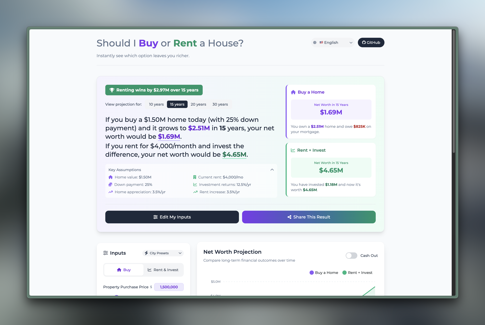

<div align="center">


<br><br>

<p>
   
   
   
   
   
   
</p>

<div align="center">

**[► 🏠 Try it Now ◄](https://rent-or-buy.homes)**

</div>

<p>
   <a href="#english"></a>
   &nbsp;&nbsp;
   <a href="#中文"></a>
   &nbsp;&nbsp;
</p>

</div>

<div align="center">
  Thank you for checking out rent-or-buy.homes!<br>
  If you find it useful or interesting, consider giving this repository a <strong>star</strong> ⭐. It helps others discover the project too.
</div>

---

<div id="english">

<h2 align="center">🏠 <a href="https://rent-or-buy.homes">rent-or-buy.homes</a></h2>
<p align="center"><i>Instantly see which option leaves you richer.</i></p>



<br><br>

Buying a house is one of the biggest financial decisions in our lifetime. Yet surprisingly, many focus on _which_ house to buy while skipping the more fundamental question:

<p align="center"><strong><i>Should I buy a house at all?</i></strong></p>

This web app helps you answer that question by showing you exactly how choosing to buy versus rent could impact your net worth over 10 / 20 / 30 years. We're talking about differences that can reach hundreds of thousands or even millions of dollars.

### 🎯 What It Does

- 🏠 **Beyond monthly payments**: Compare the true long-term wealth impact, not just monthly costs
- 📊 **Data-driven decisions**: See real projections with interactive charts and breakdowns
- 💰 **Opportunity cost**: Understand what you gain or lose by tying up money in a home vs. investing it
- 🎯 **Personalized results**: Input your specific situation, location, and financial assumptions

The app considers everything from mortgage payments and property taxes to investment returns and capital gains—giving you a clear picture of which path builds more wealth for your unique situation.

**No sign-up, no ads, no data stored on our servers—just instant, transparent math.**

<br>

### 🖥️ How to Use

**Step 1: Pick a preset or start fresh**
Choose how far into the future you want to project (10, 15, 20, 30 years). And choose a city preset (e.g. Seattle, WA) to load the default numbers based on the city's housing market.

**Step 2: Tweak Your "Buy" Scenario**

- 🏠 **Home details**: Property purchase price, down payment percentage, mortgage interest rate and term
- 💰 **Transaction costs**: Closing costs when buying, potential selling costs when you eventually sell
- 🏠 **Ongoing costs**: Property taxes, insurance, maintenance, and HOA fees
- 📈 **Growth assumptions**: Expected home appreciation rate
- 💸 **Tax considerations**: Your marginal tax rate, mortgage interest deduction, and capital gains rates

**Step 3: Tweak Your "Rent" Scenario**

- 🏠 **Rental details**: Current monthly rent and expected annual rent increases
- 📊 **Investment plan**: Choose from preset investment options (like S&P 500, NASDAQ 100) or set a custom expected return

**Step 4: Review Your Results**

- Hero banner tells you which scenario leaves you wealthier and by how much.
- Net-Worth chart visualizes the wealth difference over time.
- Cash-Outflow chart reveals where your money actually goes.

<br>

### ✨ The Calculation Method

**The Core Logic**

Same money in, see who ends up richer.

1. Same cash out the door
   Each year we total what you spend under each path.
2. Cheap-wins bonus goes to investing
   Whenever one path costs less, the savings are poured into an investment bucket for that path. This ensures that the two options have the same actual spending.
3. End-of-game tally
   After your chosen horizon we:
   - sell the house (minus agent fees),
   - cash out the fund (minus capital-gains tax),
   - pay off any mortgage balance.

The bigger pile wins.

Quick example:

- Year 1: buyer writes a big cheque (down-payment + closing); renter just pays the first year’s rent. That gap turns into the renter’s seed investment.
- Later years: buyer pays mortgage + taxes; renter pays rising rent. If one year the rent is $8000 cheaper than owning, the renter invests that $8000; if owning is cheaper, the buyer invests the difference instead.

**Put simply: spend the same, invest the spare—then see who’s richer.**

### 📝 Behind the scenes

Our calculations include these features for accuracy:

- ✅ **Mortgage amortization**: Full payment schedules with principal/interest breakdown
- ✅ **Tax optimization**: Mortgage interest deductions based on your tax bracket
- ✅ **Compound growth**: Both property appreciation and investment returns compound annually
- ✅ **Real-world costs**: Transaction fees, maintenance, insurance, and other ownership costs
- ✅ **Capital gains handling**: Different tax rates for property vs. investment gains, including tax-free thresholds

**Why This Approach Works**

This method captures the true opportunity cost of homeownership by accounting for:

- The time value of money (compound growth)
- Tax implications of both scenarios
- All associated costs, not just monthly payments
- Growth assumptions for both property and investments

All calculations are pure TypeScript functions (see [src/lib/finance/](src/lib/finance/)). No external APIs touch your data; everything runs in the browser.

> If you are interested in the calculation logic, there is also an Excel version of this calculator under [reference/validate.xlsx](reference/validate.xlsx). You can use it to calculate the results manually as well.

<br>

### 📝 License

This project is licensed under the MIT License - see the [LICENSE](LICENSE) file for details.

<br>

### 🚀 Development & Contributing

- [Open an issue](https://github.com/zebangeth/rent-or-buy.homes/issues/new) if you have suggestions or find a bug
- Fork the repository and submit a PR for new features or bug fixes

**Prerequisites**

- Node.js 18+
- npm or yarn

**Installation**

```bash
# Clone the repository
git clone https://github.com/zebangeth/rent-or-buy.homes.git
cd rent-or-buy.homes

# Install dependencies and start development server
npm install
npm run dev
```

The app will be available at `http://localhost:3000`

#### 🛠️ Tech Stack

**Core Framework**: Next.js App Router, React 19, TypeScript
**UI & Styling**: Tailwind CSS, ApexCharts
**State Management & URL State**: React Context, URL query/hash sync, LZ-String
**Internationalization**: i18next, react-i18next

#### 🏗️ Architecture

```
┌──────────────┐     state updates      ┌──────────────┐
│  InputPanel  │ ────────────────────►  │   AppContext │
│              │                        │  (useReducer)│
└──────────────┘                        └───────┬──────┘
                                                │
                                                ▼
┌──────────────┐                        ┌──────────────┐
│   URLSync    │◄─── history.replace ───│ ResultPanel  │
│   Hook       │                        │   + Charts   │
└──────────────┘                        └──────────────┘
```

**Key Components**

- **AppContext**: Centralized state management for all calculations
- **Financial Engine**: Pure calculation functions in `src/lib/finance/`
- **Input Components**: Reusable sliders, buttons, and number inputs
- **Result Visualization**: Charts and summary cards
- **URL Synchronization**: Automatic state persistence via `?s=` query parameter (legacy `#...` links are still supported)

#### 🔮 Work in Progress

- [ ] **Advanced Charts**: More detailed financial projections
- [x] **Shareable Links**: Share the results with others
- [x] **City Presets**: Refine the city presets numbers and add more cities
- [ ] **PDF Export**: Generate detailed reports

#### 🙏 Acknowledgments

- Thanks to [@Spectre](https://www.xiaohongshu.com/user/profile/6405a865000000001001f538) for Bay Area housing data support

<br />
<div align="center">
  <sub>Thank you for reading! If you find rent-or-buy.homes useful, consider giving this repository a <strong>star</strong> ⭐.</sub>
</div>

---

<div id="中文">

<h2 align="center">🏠 <a href="https://rent-or-buy.homes">rent-or-buy.homes</a></h2>
<p align="center"><i>算清买房还是租房让你更富有</i></p>


<br><br>

买房是我们大多数人一生中最重要的财务决定之一。但是再考虑买房对未来财务的影响时，许多人专注于思考*该买哪套房子*，却忽略了更根本的问题：

<p align="center"><strong><i>我到底应该买房吗？</i></strong></p>

这个 App 通过对比买房租房对你净资产的影响，帮助你回答这个问题。你会看到这个决定如何在 10 / 20 / 30 年后让你的净资产产生数百万元的差异。

### 🎯 功能特点

- 🏠 **长期影响**：比较真正的长期资产变化，而不仅仅是月度成本
- 📊 **数据驱动决策**：通过交互式数据图表了解你的资产变化
- 💰 **机会成本**：了解投入房产的资金的机会成本
- 🎯 **个性化结果**：根据你的具体情况、地理位置和财务假设，计算出最符合你情况的结果

该 App 考虑了从按揭付款、房产税到投资回报、资本利得等所有主流因素——根据你的实际情况提供清晰的资产变化对比。

**无需注册，无广告，无数据存储在我们的服务器上——只有即时、透明的计算。**

<br>

### 🖥️ 使用方法

**第 1 步：选择预设或从 0 开始**
选择你想要预测的时间范围（10 年、15 年、20 年、30 年）。选择城市预设（如西雅图、湾区）来加载基于该城市房地产市场的默认数据。

**第 2 步：调整你的"买房"方案**

- 🏠 **房产详情**：房屋购买价格、首付比例（Down Payment）、按揭利率和期限（Mortgage Rate & Term）
- 💰 **交易成本**：购买时的交易费用（Closing Costs）、出售时的潜在费用（Selling Costs）
- 🏠 **持有成本**：房产税、保险、维护费和物业管理费（HOA）
- 📈 **增长假设**：预期房产增值率
- 💸 **税收考虑**：你的边际税率、按揭利息抵扣（Mortgage Interest Deduction）和资本利得税率（Capital Gains Tax）

**第 3 步：调整你的"租房"方案**

- 🏠 **租房详情**：当前月租金和预期年租金涨幅
- 📊 **投资计划**：从预设投资选项（如标普 500、纳斯达克 100）中选择或设置自定义预期回报

**第 4 步：查看你的结果**

- Hero Section 告诉你哪种方案让你更富有，差异有多少
- 净资产图表展示时间推移中的资产变化
- 现金流出图表展示你的每年资金实际流向

<br>

### ✨ 计算方法

**核心逻辑**

同样的资金投入，看哪个选项最终更富有。

1. 同样的现金支出
   每年我们计算你在每个选项下的总支出。
2. 便宜路径的奖金用于投资
   当一个选项的支出更低时，节省的资金会被当做该选项的投资。以此保证两个选项的实际支出相等。
3. 最终结算
   在你选择的时间范围结束后，我们：
   - 出售房产（减去中介费）
   - 套现投资（减去资本利得税）
   - 偿还任何剩余按揭余额

最终净资产更多的一方获胜。

举个例子：

- 第 1 年：买房需要支付首付、过户费和第一年的持有成本；租房需要支付第一年租金。两者的差额转化为租房方案的初始投资。
- 后续年份：买房需要支付按揭、税费和持有成本；租房需要持续支付每年上涨的租金。如果某个年份的租金比持有房产便宜 8000 元，这 8000 元会被当做租房方案的投资；如果持有房产更便宜，那这个差额会被当做买房方案的投资。

**简单来说：同样的支出，投资剩余——然后看哪个选项最终拥有更多净资产。**

### 📝 幕后计算

我们的计算包括这些特征：

- ✅ **按揭摊销**：完整的还款计划，包含本金/利息分解
- ✅ **税收优化**：基于你的税收等级的按揭利息扣除
- ✅ **复利增长**：房产增值和投资回报都按年复利计算
- ✅ **现实成本**：交易费用、维护费、保险和其他拥有成本
- ✅ **资本利得处理**：房产与投资收益的不同税率，包括免税门槛

**为什么这种方法有效**

这种方法通过考虑以下因素来计算房屋所有权的真实机会成本：

- 金钱的时间价值（复利增长）
- 两种情况的税收影响
- 所有相关成本，而不仅仅是月度支出
- 房产和投资的增长假设

**所有计算都是纯 TypeScript 函数（见[src/lib/finance/](src/lib/finance/)）。没有外部 API 接触你的数据；一切都在浏览器中运行。**

> 如果你对计算逻辑感兴趣，在[reference/validate.xlsx](reference/validate.xlsx)下还有这个 App 的 Excel 版本。你也可以用它来手动计算结果。

<br>

### 📝 许可证

本项目基于 MIT 许可证 - 详情请参阅[LICENSE](LICENSE)文件。

<br>

### 🚀 开发与贡献

- [提交 issue](https://github.com/zebangeth/rent-or-buy.homes/issues/new)如果你有建议或发现了 bug
- Fork 代码库并提交 PR 来贡献新功能或修复 bug

**前提条件**

- Node.js 18+
- npm 或 yarn

**安装**

```bash
git clone https://github.com/zebangeth/rent-or-buy.homes.git
cd rent-or-buy.homes

# 安装依赖并启动开发服务器
npm install
npm run dev
```

应用将在`http://localhost:3000`可用

#### 🛠️ 技术栈

**核心框架**: Next.js App Router, React 19, TypeScript
**UI 与样式**: Tailwind CSS, ApexCharts
**状态管理与 URL 状态**: React Context, URL query/hash 同步, LZ-String
**国际化**: i18next, react-i18next

#### 🏗️ 架构

```
┌──────────────┐     state updates      ┌──────────────┐
│  InputPanel  │ ────────────────────►  │   AppContext │
│              │                        │  (useReducer)│
└──────────────┘                        └───────┬──────┘
                                                │
                                                ▼
┌──────────────┐                        ┌──────────────┐
│   URLSync    │◄─── history.replace ───│ ResultPanel  │
│   Hook       │                        │   + Charts   │
└──────────────┘                        └──────────────┘
```

**关键组件**

- **AppContext**: 所有计算的集中状态管理
- **Financial Engine**: `src/lib/finance/`中的纯计算函数
- **Input Components**: 可重用的滑块、按钮和数字输入
- **Result Visualization**: 图表和摘要卡片
- **URL Synchronization**: 通过 `?s=` 参数进行 URL 状态持久化（兼容历史 `#...` 分享链接）

#### 🔮 开发中功能

- [ ] **高级图表**: 更详细的财务预测
- [x] **生成分享链接**: 生成分享链接，与他人分享结果
- [x] **城市预设**: 完善城市预设数据并添加更多城市
- [ ] **PDF 导出**: 生成详细报告

#### 🙏 鸣谢

- 感谢 [@Spectre](https://www.xiaohongshu.com/user/profile/6405a865000000001001f538) 提供湾区房价数据支持

<br />
<div align="center">
  <sub>感谢读到这里！如果你觉得rent-or-buy.homes是一个有趣的项目，请考虑给这个代码库一个<strong>star</strong> ⭐</sub>
</div>

</div>
